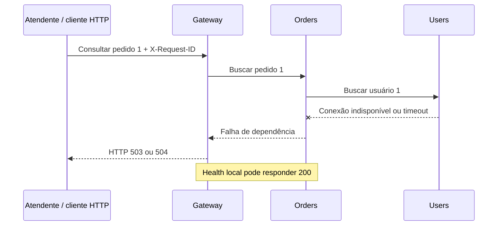

# Caso de uso para apresentação — Incidente no atendimento de uma loja virtual

## História e problema

Uma loja virtual fictícia recebe contatos de clientes que não conseguem consultar
seus pedidos. A atendente tenta abrir o pedido de ID 1 e recebe uma falha. Sem os
dados do pedido e do cliente, ela não consegue concluir o atendimento.

O operador técnico verifica o Gateway e o serviço de pedidos: ambos continuam
respondendo aos testes de saúde locais. Portanto, saber que os processos estão
ativos não explica por que a operação do cliente falha.

A pergunta da investigação é: **qual dependência está impedindo a consulta do
pedido, quais evidências sustentam essa hipótese e o que deve ser verificado
antes de encerrar o incidente?**

A loja, a atendente e o contato do cliente são elementos narrativos fictícios.
A execução utiliza APIs reais em containers, dados fictícios em memória e uma
LLM real configurada pelo apresentador. O protótipo executa consulta de pedidos
e usuários; não executa pagamento, checkout ou envio de mensagens.

## Pessoas e responsabilidades

| Participante | Necessidade ou ação |
| --- | --- |
| Cliente | Consultar um pedido existente |
| Atendente, representada pelo apresentador | Reproduzir a falha na consulta e explicar o impacto no atendimento |
| Operador técnico, representado pelo apresentador | Investigar, conferir evidências e autorizar a intervenção |
| Artefato | Reunir logs e métricas, produzir hipóteses e permitir auditoria |
| Controlador do experimento | Introduzir a indisponibilidade e restaurar o serviço |

## O que acontece no sistema



O experimento interrompe Users externamente. O diagnóstico recebe os sinais da
aplicação, sem receber a informação de que um container foi parado. Assim, a
hipótese esperada é indisponibilidade ou timeout de Users; a causa administrativa
da parada não pode ser deduzida como certeza a partir desses sinais.

## Perguntas que tornam a demonstração uma investigação

1. A consulta funciona antes da intervenção?
2. Uma falha no Gateway significa que o defeito está no Gateway?
3. Um healthcheck HTTP 200 garante que a consulta do pedido funciona?
4. O mesmo request ID permite seguir a falha entre Gateway e Orders?
5. O diagnóstico aponta Users e cita evidências consultáveis?
6. Depois da intervenção humana, a operação do cliente volta a funcionar?

## Roteiro de 12 a 15 minutos

| Tempo | Cena | O que mostrar | Mensagem para a banca |
| --- | --- | --- | --- |
| 0–2 min | Chamado de atendimento | A história e a pergunta da investigação | Uma falha de dependência impede uma operação de negócio |
| 2–4 min | Operação normal | Consulta do pedido, consultas de amostra e diagnóstico | Existe uma referência funcional antes do incidente |
| 4–6 min | Cliente afetado | HTTP 503/504, consultas afetadas e health local do Gateway | Processo ativo e operação funcional são condições diferentes |
| 6–9 min | Investigação | Request ID, eventos de dependência, snapshot e hipótese com IDs | O artefato reúne sinais dispersos em uma explicação verificável |
| 9–11 min | Decisão humana | Limitações, evidências originais e ação de restauração | A recomendação orienta a investigação; o operador decide a ação |
| 11–13 min | Validação | HTTP 200 após recuperação e diagnóstico da nova requisição | Encerrar o incidente exige confirmar a operação do cliente |
| 13–15 min | Valor e limites | Quadro antes/durante/depois e histórico da execução | O cenário demonstra apoio ao diagnóstico e rastreabilidade |

### Fala de abertura

> “O cliente não consegue consultar seu pedido. Os serviços de entrada e pedidos
> parecem saudáveis, mas a operação falha. Vou mostrar como o artefato reúne os
> sinais desse incidente, indica a dependência envolvida e permite conferir as
> evidências antes de uma decisão de recuperação.”

### Fala durante a investigação

> “O erro percebido está no Gateway. Seguindo a mesma requisição, encontramos a
> falha de Orders ao acessar Users. O diagnóstico cita os registros usados nessa
> hipótese. Vou abrir uma dessas evidências para conferir o que foi observado.”

### Fala de encerramento

> “A consulta voltou a funcionar após a restauração. Nesta execução, o artefato
> apoiou a localização da dependência envolvida e preservou o caminho de evidências.
> Ainda não medimos quanto tempo ele economiza em relação à investigação manual.”

## Execução guiada

Preparar o ambiente e a LLM conforme `README.md` e `docs/demonstracao.md`. Depois:

```powershell
.\.venv\Scripts\python.exe -B experiments\demonstrate.py --interactive --samples 3
```

O roteiro faz pausas antes das três etapas. Em cada uma, executa a requisição de
diagnóstico e uma amostra de consultas adicionais, registra os resultados e a
latência observada no cliente. As amostras são sequenciais: não constituem um
teste de carga. O healthcheck observado é o do Gateway; o snapshot contém os
sinais coletados para os demais serviços.

O novo relatório oferece uma comparação entre situação normal, indisponibilidade
e recuperação. Durante a pausa antes da recuperação, abra
`indisponibilidade.json` na pasta criada para a execução e consulte uma evidência:

```powershell
docker compose run --rm --no-deps diagnostics evidence ID_CITADO_NO_DIAGNOSTICO
docker compose run --rm --no-deps diagnostics run ID_DA_EXECUCAO
```

Não use IDs ilustrativos como se fossem resultados. Copie os IDs da execução.
Se houver falha do provedor ou uma hipótese inadequada, apresente o resultado
registrado e explique a limitação observada.

## Quadro de evidências e critérios de sucesso

| Afirmação apresentada | Evidência necessária | Critério |
| --- | --- | --- |
| A operação funcionava | Resposta da consulta normal | HTTP 200 |
| O atendimento foi afetado | Respostas das consultas durante a falha | HTTP 503 ou 504 e quantidade observada de consultas com falha |
| Health local não basta | Health do Gateway e consulta do pedido na mesma etapa | Health 200 e consulta com falha |
| A falha atravessa dependências | Logs correlacionados | Orders aponta Users e o erro chega ao Gateway |
| O diagnóstico é verificável | Hipótese, IDs e registros originais | Referências presentes no contexto e recuperáveis no histórico |
| A recuperação funcionou | Nova consulta e amostras após restauração | HTTP 200 |
| O caso pode ser auditado | Contextos, respostas e tentativas persistidas | Execução recuperável pelo ID |

A taxa de falha e a latência descrevem somente as consultas realizadas nesta
execução. Não extrapolar esses números para todos os clientes da loja. Não há
medição de receita, abandono de compra ou redução de tempo de atendimento.

## Comparação com a investigação manual

Mostre o mesmo incidente por duas formas: primeiro, o sintoma e registros
separados; depois, o contexto correlacionado, a hipótese e suas referências.
Essa comparação é ilustrativa. Para alegar ganho de tempo, será necessário
comparar participantes ou execuções com tarefas equivalentes e critérios
predefinidos. O tempo total do script inclui chamadas Docker e verificações de
auditoria; não é uma medida de tempo humano de diagnóstico.

## Extensão opcional — delimitar o incidente

Durante a indisponibilidade, consulte também `GET /orders/999`. Esse pedido não
existe, e Orders responde 404 antes de consultar Users. Já o pedido existente
de ID 1 depende de Users e falha com 503 ou 504.

Esse contraste ajuda a explicar que serviços ativos podem atender uma rota e
falhar em outra, conforme as dependências da operação. O 404 é uma resposta
esperada para um dado inexistente; ele não equivale à indisponibilidade da
consulta de um pedido válido.

Essa verificação é manual e não está entre as três etapas automatizadas.
Registre o status observado se a utilizar. O roteiro atual não testa a
classificação de 404 pela LLM; não atribua esse resultado ao diagnóstico.

## Extensão ao vivo — sobrecarga concorrente e diagnóstico por IA

Na interface de apresentação em `http://127.0.0.1:8090`, use o botão
**“4 · Sobrecarga + IA”**. A cena habilita temporariamente um limite experimental
de três operações simultâneas em Users e dispara doze consultas concorrentes ao
pedido 1, todas com o mesmo identificador de correlação.

O resultado esperado é:

- três consultas concluídas e nove recusadas com HTTP 503;
- health checks de Gateway, Orders e Users respondendo HTTP 200 após a rajada;
- logs `overload_rejected` em Users com erro `ConcurrencyLimitExceeded`;
- propagação do 503 de Users para Orders e, então, para o Gateway;
- diagnóstico `incident` da LLM real, apontando a saturação de Users e citando
  as evidências que sustentam a hipótese.

### Fala sugerida

> “Agora não vou desligar nenhum container. Vou provocar várias consultas ao
> mesmo tempo. Users aceita somente três operações simultâneas neste experimento
> e rejeita o excesso. O artefato coleta os logs dos três serviços, correlaciona
> a cadeia e envia esse contexto à IA. A conclusão não foi escrita na tela: ela
> veio do modelo configurado, e abaixo estão o modelo, o ID da execução e os
> registros citados.”

O limite e o atraso são artificiais e só ficam ativos durante essa cena. O
experimento demonstra rejeição por saturação e indisponibilidade parcial da
operação, não a queda do processo ou a capacidade máxima real do sistema. Ao
terminar, a interface recria Users sem o limite e reativa o coletor contínuo.

## Evidência histórica disponível

A execução de 24/09/2026, registrada em
`docs/evidencias/20260924T221853Z-40eb62/`, utilizou LLM real e apresentou:

| Situação | HTTP | Resultado do diagnóstico |
| --- | --- | --- |
| Normal | 200 | `no_incident` |
| Users indisponível | 504 | `incident`, com hipótese referente a Users |
| Recuperação | 200 | `no_incident` |

Esses arquivos permitem uma apresentação baseada em evidências existentes caso
a execução ao vivo não esteja disponível. Eles não contêm as novas medições de
amostras e latências: esses resultados dependem de uma nova execução do roteiro.

## Perguntas prováveis da banca

**“O artefato corrige o código?”** Apoia a investigação de falhas em execução.
A correção ou restauração depende da análise e da decisão humanas.

**“Como sabemos que a IA não recebeu a resposta?”** O registro da intervenção
fica em `controle-experimental.json`, separado dos logs e snapshots fornecidos
ao diagnóstico. O contexto enviado pode ser inspecionado em `run.context`.

**“Ela descobriu por que Users parou?”** Identificou os sinais de
indisponibilidade e seu impacto. Determinar a causa da parada exige outras
evidências.

**“Isso já prova eficiência ou acurácia geral?”** Demonstra o funcionamento e
apoio à investigação nessa instância. Uma avaliação geral exige outros tipos de
falha, repetições e comparação com uma referência.
